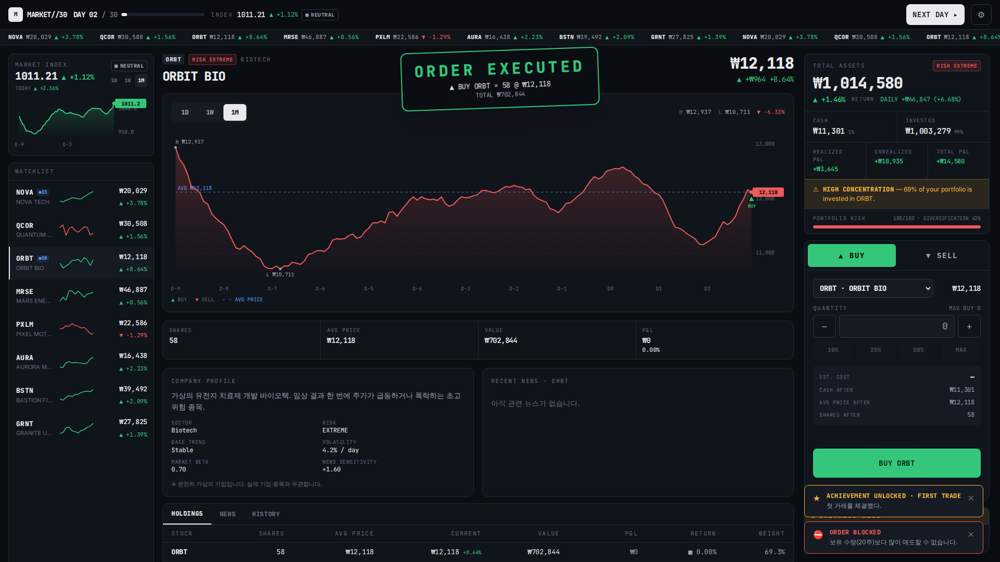
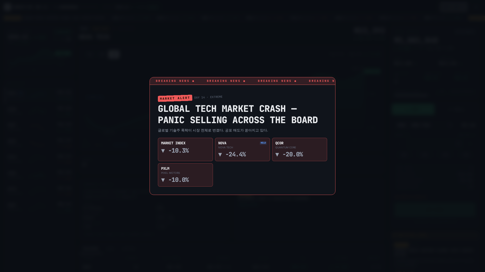
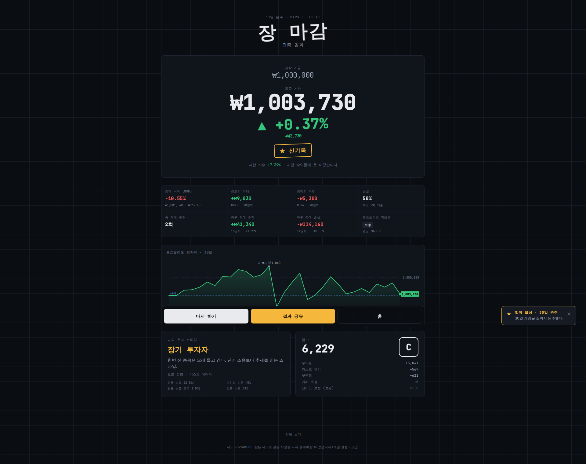
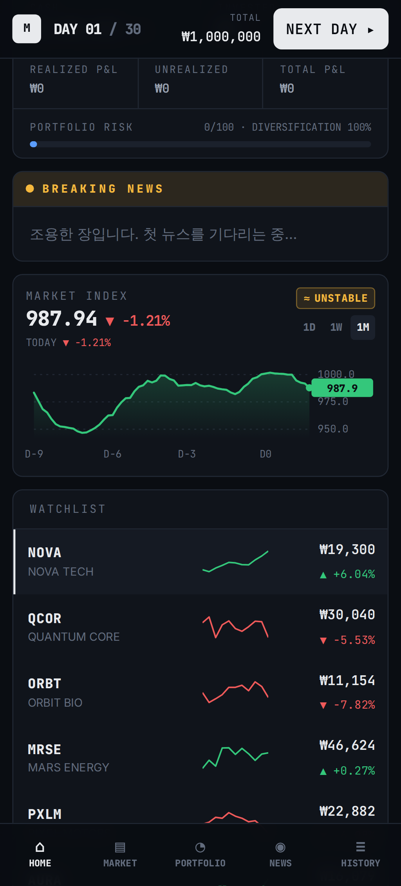

# MARKET//30

**30 DAYS. ₩1,000,000. ONE MARKET.**

MARKET//30은 브라우저에서 플레이하는 가상 주식 투자 게임입니다. ₩1,000,000의 게임 머니로 시작해 30일 동안 가상 기업의 주식을 사고팝니다. 매일 아침 뉴스가 나오고 가격이 움직이며, 게임이 끝나면 최종 성적이 나옵니다.

> ⚠️ 이 게임은 완전히 가상입니다. 모든 기업, 가격, 뉴스, 거래는 게임 안에서 만들어진 허구의 데이터입니다. 실제 증권 계좌 연결, 주문, 결제, 투자 추천 기능은 없고 실제 주가 API도 쓰지 않습니다.

| Terminal | Breaking news (crash) | Result | Mobile |
| --- | --- | --- | --- |
|  |  |  |  |

## 실행 방법

```bash
npm install
npm run dev          # http://localhost:5173
npm run build        # 타입 검사 후 production 빌드 (dist/)
npm run preview      # 빌드 결과를 로컬에서 서빙
```

| Script | 설명 |
| --- | --- |
| `npm run lint` | ESLint |
| `npm run typecheck` | TypeScript (strict) |
| `npm test` | Vitest 엔진 단위 테스트 |
| `npm run test:e2e` | Playwright E2E (데스크톱 1920×1080, 모바일 375/390/414/430, 디버그 모드) |
| `npm run sim` | 밸런스 시뮬레이션: 봇 전략으로 수백 개 시드를 플레이해 수익률 분포를 출력 |
| `npm run check` | lint + typecheck + test + build |

빌드 결과물은 상대 경로(`base: './'`)와 HashRouter를 쓰기 때문에 어떤 정적 호스팅에도 그대로 올릴 수 있습니다.

## Cloudflare Pages 배포

정적 사이트(Vite 빌드 결과물 `dist/`)라 서버 없이 Cloudflare Pages에 그대로 올릴 수 있습니다. HashRouter와 상대 경로를 쓰기 때문에 SPA 리다이렉트 설정도 필요 없습니다.

**GitHub 연동 (추천, 푸시하면 자동 배포)**
1. Cloudflare 대시보드 → Workers & Pages → Create → Pages → Connect to Git → 이 저장소를 선택합니다.
2. 빌드 설정:
   - Framework preset: `Vite` (또는 None)
   - Build command: `npm run build`
   - Build output directory: `dist`
   - Production branch: 배포할 브랜치
3. Node 버전은 저장소의 `.node-version`(22)을 자동으로 읽습니다. 안 되면 환경 변수 `NODE_VERSION=22`를 추가합니다.

**CLI로 직접 업로드**
```bash
npm run build
npx wrangler login
npx wrangler pages deploy dist --project-name market30
```

디버그 패널은 production 빌드에서 자동으로 숨겨집니다. 배포본에서도 쓰려면 환경 변수 `VITE_ENABLE_DEBUG=true`를 넣고 빌드합니다.

## 언어

UI는 한국어 사용자 기준으로 만들었습니다. 버튼, 라벨, 뉴스 헤드라인, 시장 상태, 위험도, 업적, 결과 화면이 모두 한국어입니다. 브랜드명(MARKET//30), 가상 기업명, 티커(NOVA, QCOR…)는 영어 그대로 둡니다. 속보나 주문 체결처럼 연출이 강한 장면은 한국어를 크게 쓰고 영어 원문(BREAKING NEWS, ORDER EXECUTED)을 작게 붙였습니다. enum 값을 한국어로 바꾸는 표시용 라벨은 `src/lib/labels.ts`에 모아 두었습니다.

## 게임 루프

```
DAY START ─▶ BREAKING NEWS ─▶ TRADING ─▶ MARKET CLOSED ─▶ DAILY REPORT ─▶ 다음 날
   (장 시작)   (뉴스 → 가격 반영)  (매수/매도)                       (DAY 30 이후 → 최종 정산 → RESULT)
```

- **뉴스 → 가격**: 장이 열리면 그날의 사건이 BREAKING NEWS로 뜹니다. 관련 종목이 강조되고, 가격 변화(%)가 나타나고, 포트폴리오 평가액이 바뀝니다. 이 순서대로 연출됩니다.
- **힌트**: 일부 사건은 전날 `RUMOR` / `ANALYST NOTE`로 미리 예고됩니다. 방향을 알 수 있는 힌트가 있으면 전날 가격이 일부 선반영됩니다. "실적 발표 내일" 같은 모호한 힌트는 방향을 알려주지 않습니다. 끝내 일어나지 않는 헛소문도 섞여 있습니다.
- **극적인 사건**: 매 게임마다 시장 폭락(CRASH)과 급등장(RALLY)이 반드시 한 번씩 있습니다. 대형 개별 호재/악재도 각각 최소 한 번 있고, 70% 확률로 "급등 후 급락" 스토리가 붙습니다. 폭락 직후에는 `HOLD / SELL ALL / BUY THE DIP` 중 하나를 고르게 됩니다.
- **리스크**: 종목마다 위험도가 LOW에서 EXTREME까지 있습니다. 포트폴리오 리스크는 투자 비중 × 보유 종목의 위험도 × 집중도로 계산합니다. 한 종목이 총자산의 50%를 넘으면 `HIGH CONCENTRATION` 경고가 뜹니다. 경고만 띄우고 거래를 막지는 않습니다.
- **결과**: 최종 자산, 수익률, MDD, 베스트/워스트 트레이드, 승률, 하루 최대 이익/손실, 리스크, 트레이딩 스타일(실제 거래 기록으로 분류), 점수/등급, 업적이 순서대로 공개됩니다. 공유 카드는 PNG로 생성되며 요약 지표만 담고 거래 내역은 넣지 않습니다.

## 플레이 도우미

- **게임 방법 안내**: 첫 게임에서 장이 열리면 5단계 가이드가 한 번 뜹니다. 상단 `?` 버튼으로 다시 볼 수 있고, 설정에서 다시 켤 수도 있습니다.
- **다가오는 일정**: 실적 발표, 임상 결과, 금리 결정, 신제품 행사는 최대 3일 전에 캘린더에 표시됩니다. 날짜와 대상만 보여 주고, 결과 방향은 발표 전까지 알 수 없습니다.
- **소문 표시**: 오늘 도는 루머나 애널리스트 노트는 속보 화면, 관심 종목의 `소문` 배지, 알림으로 알려 줍니다.
- **빠른 진행**: `N` 키로 장을 마감하고 `Enter`로 리포트와 속보를 넘길 수 있어 키보드만으로 하루가 진행됩니다. 설정의 "일일 리포트 건너뛰기"를 켜면 결산 화면 없이 바로 다음 날로 넘어갑니다.
- **효과음**: Web Audio API로 실시간 합성하기 때문에 음원 파일이 없습니다. 매수는 상승음, 매도는 코인 소리, 주문 불가는 경고음, 장 시작과 마감은 종소리, 속보는 뉴스 알림음이 납니다. 폭락에는 경보와 하강음, 급등에는 상승 아르페지오가 나오고, 결과 발표에서는 카운트 → 수익 팡파르 또는 손실 멜로디 → 신기록 효과음이 이어집니다. 상단 🔊 버튼이나 설정에서 끄거나 볼륨을 조절할 수 있습니다.
- **읽히는 뉴스**: 헤드라인에 나온 종목은 뉴스 방향으로 의미 있게 움직입니다. 뉴스가 하나뿐인 날 기준으로 방향 일치율은 90% 이상입니다. 작은 뉴스에는 가끔 "재료 소멸"로 소폭 반대 반응이 나오지만, 그 폭은 6% 미만입니다.

## 아키텍처

```
src/
  domain/        타입, 상수 (순수 데이터)
  data/          기업 · 이벤트 · 시장 상태 · 난이도 · 업적 정의 (data-driven)
  engine/        시뮬레이션 (React와 무관한 순수 함수)
    marketEngine     시장 상태 Markov 전이, 가격 형성, 장중 틱, 지수
    eventScheduler   시드 기반 30일 이벤트 캘린더, 힌트, 헛소문, 드라마 보장
    portfolioEngine  평가액, 평균단가, 실현/미실현 손익, 리스크, 집중도
    tradingEngine    주문 검증 + 체결
    scoringEngine    MDD, 성과 지표, 점수, 등급, 스타일, 업적
    gameEngine       라이프사이클 + phase state machine, 디버그 헬퍼
  persistence/   localStorage 저장/로드 + 검증 + 손상 시 fallback
  store/         zustand 스토어 (엔진 호출, 업적, 저장 연결) + memoized selectors
  components/    UI 프리미티브, SVG 차트
  features/      터미널, 마켓, 주문, 포트폴리오, 뉴스, 히스토리, 연출(flow), 공유, 디버그
  screens/       Home / Setup / Game / Result / Settings
```

### 가격 모델

```
하루 수익률 = baseTrend
           + beta × (시장 상태 drift + 시장 노이즈 + 시장 뉴스)
           + 고유 변동성 × 시장 상태 배수 × 난이도 (fat-tail)
           + 이벤트 영향 (severity 범위 × eventSensitivity × 호재/악재 비대칭)
           + 모멘텀 (이전 뉴스의 follow-through / 반전)
           − 평균 회귀 (fair value 기준)
```

Severity별 기본 영향폭은 Minor ±1–3%, Moderate ±3–8%, Major ±8–15%, Extreme ±15–30%입니다. 시장 상태(BULL / NEUTRAL / BEAR / VOLATILE / CRASH / RALLY)는 모든 종목의 추세, 변동성, 호재·악재 민감도를 바꿉니다. CRASH와 RALLY는 뉴스를 통해서만 들어가기 때문에, 폭락이나 급등이 오면 항상 원인이 된 헤드라인을 찾을 수 있습니다.

### 결정성 (seed)

시장은 `gameSeed`만으로 완전히 결정됩니다. 가격 엔진은 플레이어 포트폴리오를 읽지 않고, 시스템마다 별도의 RNG 스트림을 씁니다. 그래서 같은 시드를 넣으면 같은 시장이 다시 나옵니다(SETUP › ADVANCED). 결과 화면에 시드가 표시됩니다.

### 확장

- **기업 추가**: `src/data/stocks.ts`에 항목 하나를 추가하면 됩니다. 이벤트가 `tags`로 대상을 찾기 때문에 기존 이벤트가 새 기업에도 자동으로 적용됩니다.
- **이벤트 추가**: `src/data/events.ts`에 템플릿을 추가합니다(`COMPANY` / `SECTOR` / `MARKET` scope). 선택적으로 `hint`를 붙일 수 있습니다.

## Debug Mode

개발 서버에서 `http://localhost:5173/?debug=true` 로 접속하면 디버그 패널이 열립니다. production 빌드에서는 기본으로 숨겨지고, `VITE_ENABLE_DEBUG=true` 로 빌드했을 때만 켜집니다. 패널 코드는 lazy chunk로 분리되어 있습니다.

패널에서 볼 수 있는 값: DAY, PHASE, MARKET STATE, SEED, MARKET INDEX, TOTAL ASSET, CASH, EVENT QUEUE.

패널에서 할 수 있는 동작: Next Day, Trigger Bull, Trigger Crash, Random Event, +₩1,000,000, Reset Market, Reset Portfolio, Finish Game, Set Day, Set Stock Price, 시장 상태 강제 변경.

## 저장

localStorage에 `market30:save:v1`(진행 중인 게임)과 `market30:meta:v1`(업적, 개인 기록, 설정)을 저장합니다. 불러올 때 구조를 검증하고, 데이터가 손상되어 있으면 백업한 뒤 안내 메시지를 띄우고 새 게임을 시작할 수 있게 합니다. 저장소를 쓸 수 없는 환경에서도 게임은 계속 플레이할 수 있습니다.

## 밸런스 (NORMAL, 300 seeds, `npm run sim`)

| 전략 | 수익률 p10 / p50 / p90 | 수익 확률 | MDD p50 |
| --- | --- | --- | --- |
| 8종목 균등 보유 | −5% / +5% / +15% | ~75% | 11% |
| NOVA 올인 | −14% / +10% / +40% | ~69% | 25% |
| ORBIT(EXTREME) 올인 | −26% / +4% / +40% | ~55% | 28% |
| 방어주(LOW)만 | −5% / +2% / +8% | ~65% | 8% |
| 뉴스 추격 매매 | −11% / 0% / +16% | ~51% | 12% |

분산할수록 안정적이고, 집중할수록 결과의 폭이 커집니다. 이미 오른 뉴스를 뒤늦게 쫓아가면 평균적으로 이득이 없습니다.
